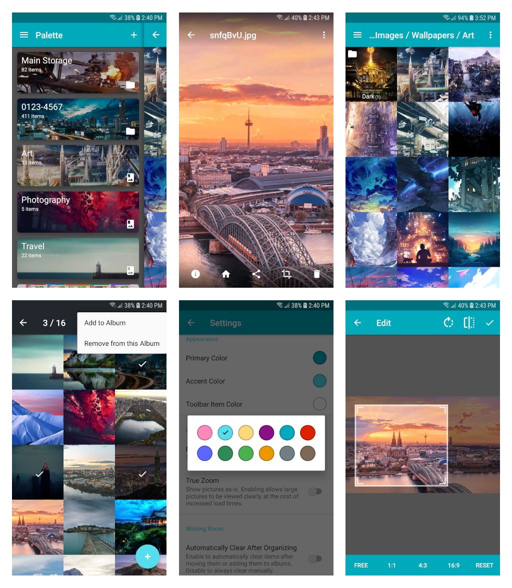

# Palette

Full resolution previews can be found in the screenshots folder.

## Features

- **Folder navigation**: browse photos in a natural file hierarchy, showing relevant folders and hiding irrelevant ones
- **Synchronized albums**: photos from folders can be automatically added to albums
- **Dedicated waiting room**: new photos are all in one place, so you can quickly find them and deal with them
- Quick access to all root folders and albums
- Custom covers/thumbnails for albums and folders
- Themes
- Nested albums
- Deep-zoom for photos
- Share-to and open-with capabilities
- Instantly jump to a photo's file location
- Swipe gestures everywhere
- Recycle bin
- And of course the basics, like moving, deleting, renaming, and cropping photos

## Bugs

- On some devices, the initial popup for accessing SD card might be not clickable after a fresh install. Tap the device's home button (or recent apps button) then return to the app to make it clickable again.

## Acknowledgements

- Image viewing uses [Glide](https://github.com/bumptech/glide), [SSIV](https://github.com/davemorrissey/subsampling-scale-image-view), and [PhotoView](https://github.com/chrisbanes/PhotoView)
- Image cropping uses [Android Image Cropper](https://github.com/ArthurHub/Android-Image-Cropper)
- RecyclerView and related structures are handled by [FlexibleAdapter](https://github.com/davideas/FlexibleAdapter)
- Dialogs from [Material Dialogs](https://github.com/afollestad/material-dialogs) and [FileListerDialog](https://github.com/FirzenYogesh/FileListerDialog)
- Color picker uses [Color Preference](https://github.com/kizitonwose/colorpreference)
- Swipe gestures use [Slidr](https://github.com/r0adkll/Slidr)
- Custom crash activity from [Custom Activity On Crash](https://github.com/Ereza/CustomActivityOnCrash)